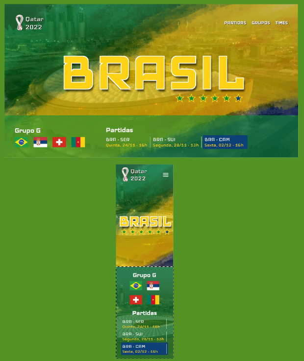

# landing-page-Brasil-World-Cup-Qatar-2022

---

## Sobre

Landing page da Copa do Mundo Qatar - Brasil.
O objetivo desse projeto é colocar em prática o conhecimento adquirido sobre as linguagens de marcação HTML, CSS e Markdown.

---

## Tecnologia utilizadas

-   HTML
-   CSS
-   Resposividade
-   Markdown

---

## Autor

-   [Alexsander Costa](https://github.com/AlexsanderCostaDEV/)
